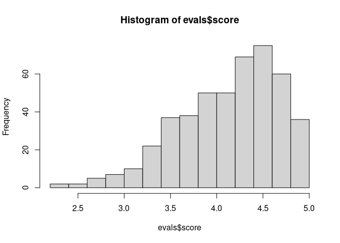
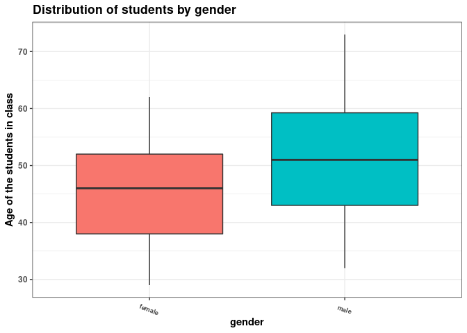
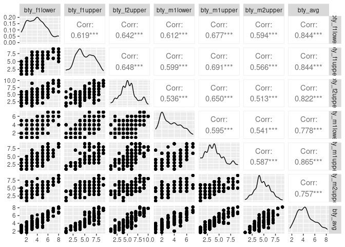

Activity 4 - Day 1
================

``` r
library(tidyverse)
library(tidymodels)
library(GGally)
```

``` r
evals <- readr::read_tsv("https://www.openintro.org/data/tab-delimited/evals.txt")
```

    ## Rows: 463 Columns: 23
    ## ── Column specification ────────────────────────────────────────────────────────
    ## Delimiter: "\t"
    ## chr  (9): rank, ethnicity, gender, language, cls_level, cls_profs, cls_credi...
    ## dbl (14): course_id, prof_id, score, age, cls_perc_eval, cls_did_eval, cls_s...
    ## 
    ## ℹ Use `spec()` to retrieve the full column specification for this data.
    ## ℹ Specify the column types or set `show_col_types = FALSE` to quiet this message.

``` r
dplyr::glimpse(evals)
```

    ## Rows: 463
    ## Columns: 23
    ## $ course_id     <dbl> 1, 2, 3, 4, 5, 6, 7, 8, 9, 10, 11, 12, 13, 14, 15, 16, 1…
    ## $ prof_id       <dbl> 1, 1, 1, 1, 2, 2, 2, 3, 3, 4, 4, 4, 4, 4, 4, 4, 4, 5, 5,…
    ## $ score         <dbl> 4.7, 4.1, 3.9, 4.8, 4.6, 4.3, 2.8, 4.1, 3.4, 4.5, 3.8, 4…
    ## $ rank          <chr> "tenure track", "tenure track", "tenure track", "tenure …
    ## $ ethnicity     <chr> "minority", "minority", "minority", "minority", "not min…
    ## $ gender        <chr> "female", "female", "female", "female", "male", "male", …
    ## $ language      <chr> "english", "english", "english", "english", "english", "…
    ## $ age           <dbl> 36, 36, 36, 36, 59, 59, 59, 51, 51, 40, 40, 40, 40, 40, …
    ## $ cls_perc_eval <dbl> 55.81395, 68.80000, 60.80000, 62.60163, 85.00000, 87.500…
    ## $ cls_did_eval  <dbl> 24, 86, 76, 77, 17, 35, 39, 55, 111, 40, 24, 24, 17, 14,…
    ## $ cls_students  <dbl> 43, 125, 125, 123, 20, 40, 44, 55, 195, 46, 27, 25, 20, …
    ## $ cls_level     <chr> "upper", "upper", "upper", "upper", "upper", "upper", "u…
    ## $ cls_profs     <chr> "single", "single", "single", "single", "multiple", "mul…
    ## $ cls_credits   <chr> "multi credit", "multi credit", "multi credit", "multi c…
    ## $ bty_f1lower   <dbl> 5, 5, 5, 5, 4, 4, 4, 5, 5, 2, 2, 2, 2, 2, 2, 2, 2, 7, 7,…
    ## $ bty_f1upper   <dbl> 7, 7, 7, 7, 4, 4, 4, 2, 2, 5, 5, 5, 5, 5, 5, 5, 5, 9, 9,…
    ## $ bty_f2upper   <dbl> 6, 6, 6, 6, 2, 2, 2, 5, 5, 4, 4, 4, 4, 4, 4, 4, 4, 9, 9,…
    ## $ bty_m1lower   <dbl> 2, 2, 2, 2, 2, 2, 2, 2, 2, 3, 3, 3, 3, 3, 3, 3, 3, 7, 7,…
    ## $ bty_m1upper   <dbl> 4, 4, 4, 4, 3, 3, 3, 3, 3, 3, 3, 3, 3, 3, 3, 3, 3, 6, 6,…
    ## $ bty_m2upper   <dbl> 6, 6, 6, 6, 3, 3, 3, 3, 3, 2, 2, 2, 2, 2, 2, 2, 2, 6, 6,…
    ## $ bty_avg       <dbl> 5.000, 5.000, 5.000, 5.000, 3.000, 3.000, 3.000, 3.333, …
    ## $ pic_outfit    <chr> "not formal", "not formal", "not formal", "not formal", …
    ## $ pic_color     <chr> "color", "color", "color", "color", "color", "color", "c…

``` r
hist(evals$score)
```

<!-- -->

The distribution is left skewed.

``` r
evals %>% ggplot(aes( y = age, 
                      x = gender,
                      fill = gender)) +
  geom_boxplot() +
  labs(y = "Age of the Student",
       x = "Gender of the Student",
    title = "Distribution of students' Age vs Gender") + 
  theme_bw() +
  scale_color_viridis_d()
```

<!-- -->

From the above plot we can say that most of the female students are of
age of 45 and most of the male students are age of around 50.

``` r
evals %>% select(starts_with("bty_")) %>% ggpairs
```

<!-- -->

``` r
m_bty_gen <- lm(score ~ bty_avg + gender, data = evals)
tidy(m_bty_gen)
```

    ## # A tibble: 3 × 5
    ##   term        estimate std.error statistic   p.value
    ##   <chr>          <dbl>     <dbl>     <dbl>     <dbl>
    ## 1 (Intercept)   3.75      0.0847     44.3  6.23e-168
    ## 2 bty_avg       0.0742    0.0163      4.56 6.48e-  6
    ## 3 gendermale    0.172     0.0502      3.43 6.52e-  4

``` r
m_int <- lm(score ~ bty_avg * gender, data = evals)
tidy(m_int)
```

    ## # A tibble: 4 × 5
    ##   term               estimate std.error statistic   p.value
    ##   <chr>                 <dbl>     <dbl>     <dbl>     <dbl>
    ## 1 (Intercept)          3.95      0.118      33.5  2.92e-125
    ## 2 bty_avg              0.0306    0.0240      1.28 2.02e-  1
    ## 3 gendermale          -0.184     0.153      -1.20 2.32e-  1
    ## 4 bty_avg:gendermale   0.0796    0.0325      2.45 1.46e-  2

``` r
r_int <- lm(score ~ bty_avg * rank, data = evals)
tidy(r_int)
```

    ## # A tibble: 6 × 5
    ##   term                     estimate std.error statistic  p.value
    ##   <chr>                       <dbl>     <dbl>     <dbl>    <dbl>
    ## 1 (Intercept)                4.10      0.150    27.4    1.80e-98
    ## 2 bty_avg                    0.0417    0.0314    1.33   1.84e- 1
    ## 3 ranktenure track          -0.0188    0.230    -0.0818 9.35e- 1
    ## 4 ranktenured               -0.409     0.182    -2.25   2.52e- 2
    ## 5 bty_avg:ranktenure track  -0.0264    0.0463   -0.570  5.69e- 1
    ## 6 bty_avg:ranktenured        0.0659    0.0392    1.68   9.38e- 2
